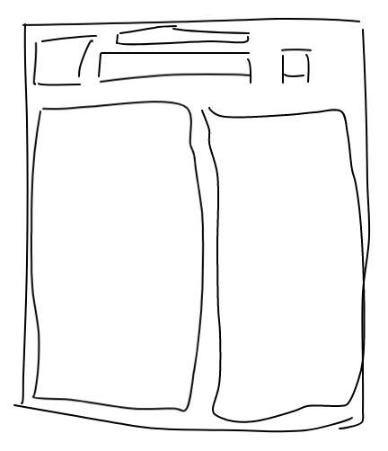

## Lyrics

A sing along app intended to improve english lessons.

### `npm start`

Runs the app in the development mode. 
Open [http://localhost:3000](http://localhost:3000) to view it in the browser.

### What it will be

The first draft that I could think is something like this:

|:--:|
| _Image merely illustrative_ |

### Todo

- [x] Lyric by artist and title
- [x] Get by artist with multiples names
- [ ] Lyric translation to PT-BR
- [ ] Top music list
